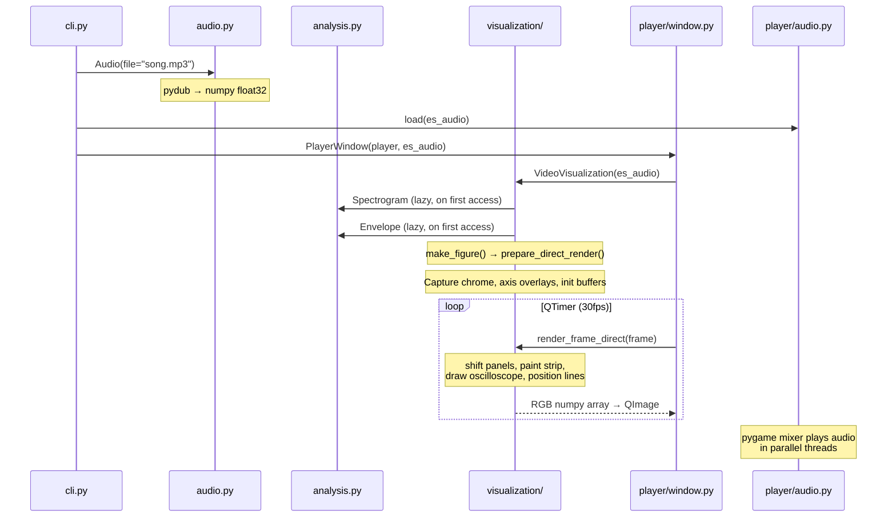
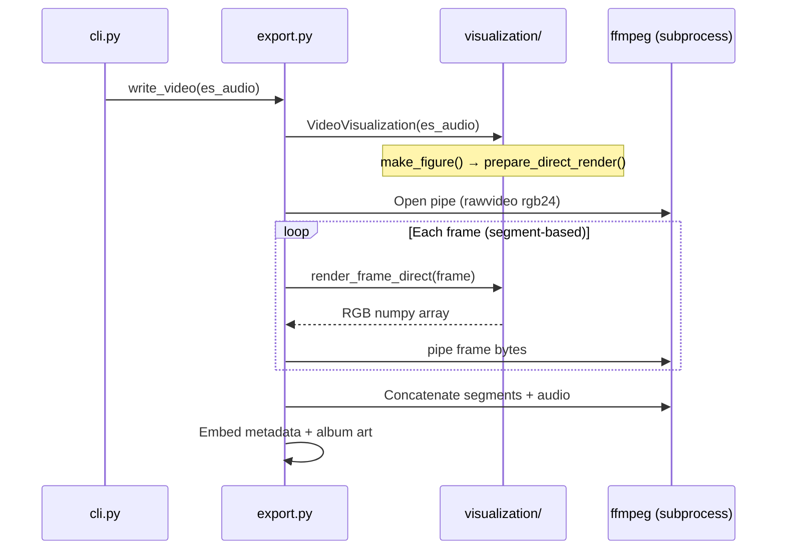
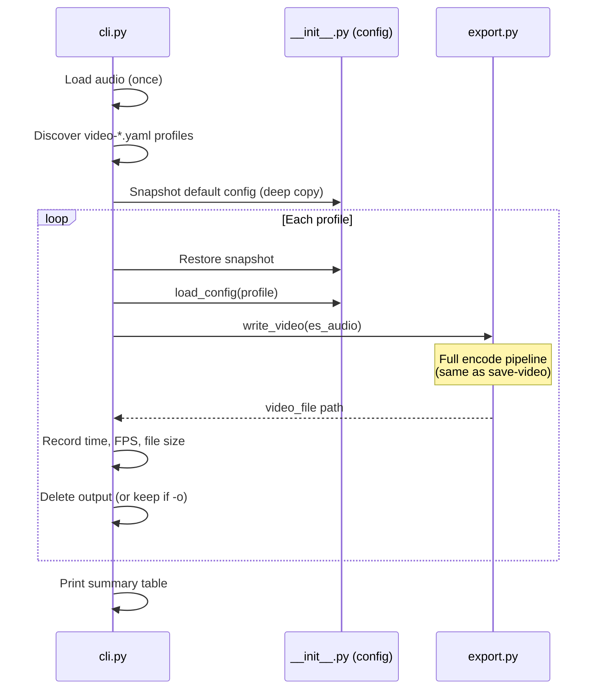

# EstimPy Architecture

EstimPy is a Python toolkit for visualizing and playing back estim audio files. It provides a CLI (`estimpy`) that can launch an interactive real-time player, render static image visualizations, export animated videos, and embed album art into audio file metadata. The core abstractions are: **Audio** (load and normalize audio data), **Analysis** (compute spectrograms and envelopes via DSP), **Visualization** (render panels using matplotlib and direct pixel manipulation), and **Player** (real-time playback with a Qt GUI). All behavior is driven by a hierarchical YAML configuration system with `default.yaml` as the single source of truth for defaults.

## Directory Structure

```
src/estimpy/
├── __init__.py              # Package init, config system, event bus, dependency checks
├── cli.py                   # CLI entry point — argument parsing and command routing
├── audio.py                 # Audio loading, normalization, resampling
├── analysis.py              # DSP: spectrograms (standard + reassigned), envelopes
├── visualization/
│   ├── __init__.py          # Re-exports, config event handler, colormap derivation
│   ├── base.py              # Visualization class (static images), enums, show_image, set_optimal_nfft
│   ├── video.py             # VideoVisualization: direct render pipeline, shift-and-paint
│   └── oscilloscope.py      # OscilloscopeMixin: per-channel waveform overlay
├── export.py                # File export: images (matplotlib) and videos (ffmpeg pipe)
├── metadata.py              # ID3/MP4 tag reading/writing via mutagen
├── utils.py                 # Shared helpers: file dialogs, spinners, temp files, formatting
├── player/
│   ├── __init__.py          # Re-exports Player class
│   ├── player.py            # Playback state machine: playlist, volume, mute, repeat
│   ├── audio.py             # Low-level pygame mixer: play, stop, volume ramping
│   ├── window.py            # PyQt6 GUI: controls, keyboard shortcuts, frame loop
│   └── playlist_window.py   # Playlist management dialog (add/remove/reorder, M3U)
└── config/
    ├── default.yaml         # Canonical defaults (single source of truth)
    └── *.yaml               # Named profiles: video codecs, resolutions, player presets

tests/
├── conftest.py              # Pytest fixtures: synthetic audio, config isolation
├── generate_benchmark.py    # Generates benchmark.mp3 from source files in input/benchmark/ (--output-length, --segment-length, --output)
├── test_audio.py            # Audio loading, normalization, triphase, resampling
├── test_analysis.py         # Envelope computation, spectrogram generation, FFT sizing
├── test_config.py           # Config loading, updates, type casting, event system
├── test_metadata.py         # Tag read/write, image format detection
├── test_utils.py            # Formatting, file path helpers
└── input/
    ├── test.mp3             # Synthetic 1s test tone
    ├── benchmark.mp3        # 1-minute benchmark file (generated, committed)
    └── benchmark/           # Source audio files for benchmark generation (gitignored)
```

**Why this layout:** The top-level modules map 1:1 to pipeline stages (load → analyze → visualize → export). The `visualization/` and `player/` packages are separate subpackages because they have significant internal structure — visualization splits rendering concerns across static images, video pipeline, and oscilloscope overlay, while player manages GUI dependencies (PyQt6, pygame) with its own internal layering (state management, audio engine, window). Config profiles live alongside the code they configure so they ship with the package.

## Key Modules & Their Roles

### `__init__.py` — Configuration Hub
- **Responsibility:** Load YAML configs into a flat `cfg` dict, provide an event system (`config.updated`), check system dependencies (ffmpeg/ffprobe), import all submodules.
- **Key exports:** `cfg` (current config), `base_cfg` (file-loaded config), `load_config()`, `update_config_values()`, `add_event_listener()`, `trigger_event()`.
- **Profile resolution:** Bare profile names are resolved against both the builtin config directory (`src/estimpy/config/`) and the user config directory (`~/.estimpy/`). When a profile exists in both locations, the builtin is loaded first and the user version overlays on top. Each profile may declare `additional-config-profiles` to chain further profiles after itself, with cycle detection to prevent infinite loops. The `estimpy-version` key is checked against the running version and produces a warning if the profile targets a newer release.
- **Dependents:** Every other module accesses `es.cfg['key']` for configuration.

### `audio.py` — Audio Data
- **Responsibility:** Load audio files (via pydub/ffmpeg), normalize to float32 `[-1, 1]`, expose as numpy arrays shaped `(channels, samples)`.
- **Key class:** `Audio` — properties: `data`, `data_raw`, `sample_rate`, `channels`, `length`, `metadata`. Methods: `with_triphase()` (derive 3rd channel as `-(A+B)`), `resample()`.
- **Dependencies:** pydub, numpy, scipy (resampling).
- **Dependents:** analysis, visualization, player, export, metadata.

### `analysis.py` — DSP Engine
- **Responsibility:** Compute spectrograms and amplitude envelopes from audio data.
- **Key classes:**
  - `Spectrogram` — FFT-based spectrogram with optional reassignment for sharper time-frequency localization. Supports auto-scaling frequency range via spectral edge detection.
  - `Envelope` — Sliding-window peak and RMS amplitude envelopes using numpy stride tricks (zero-copy).
- **Dependencies:** numpy, scipy.
- **Dependents:** visualization (lazy-loaded via properties).
- **Notable:** Reassigned spectrograms use three FFTs per frame, 2D histogram accumulation, and Nadaraya-Watson kernel smoothing. Processes in memory-bounded chunks (~500MB limit).

### `visualization/` — Rendering Subpackage
- **Responsibility:** All visual output — matplotlib figure creation, per-frame direct pixel rendering, oscilloscope overlay, colormap derivation, axis formatting.
- **`__init__.py`** — Re-exports the public API (`Visualization`, `VideoVisualization`, `VisualizationMode`, `show_image`, `set_optimal_nfft`), handles `config.updated` events (resolution parsing, font initialization, channel color derivation, colormap generation), and contains internal helpers (`_alpha_color`, `_derive_channel_colormap`, `_parse_resolution`, `_calculate_spectrogram_panel_height`).
- **`base.py`** — `Visualization` class for static image rendering: matplotlib figure construction with amplitude + spectrogram panels per channel, layout, styling, axis formatting. Also contains `AxisScaleText`, `AxisTypes`, `VisualizationMode` enums, `show_image()`, and `set_optimal_nfft()`.
- **`video.py`** — `VideoVisualization(Visualization, OscilloscopeMixin)` extends base with time-windowed sliding view, the shift-and-paint direct render pipeline (`prepare_direct_render()`, `render_frame_direct()`), and all shift/paint/overlay methods for per-frame updates.
- **`oscilloscope.py`** — `OscilloscopeMixin` provides per-channel oscilloscope waveform overlays with trigger stabilization (zero-crossing and correlation-based), pulse detection via CV analysis, and duration label rendering. Used as a mixin because the methods share extensive instance state with `VideoVisualization`.
- **Dependencies:** matplotlib, PIL (ImageFont for direct text rendering), numpy, colorsys.
- **Dependents:** export, player/window.

### `export.py` — File Output
- **Responsibility:** Write images via matplotlib and encode videos by piping raw RGB frames to ffmpeg.
- **Key functions:** `write_image()`, `write_video()`. `write_video()` returns a result dict (`file`, `encoding_fps`, `total_frames`, `encoding_time`, `file_size`) on success, `None` on failure.
- **Notable:** Video export uses segment-based encoding (configurable segment length, default 3600s) with resume support. Segments are concatenated with ffmpeg's concat demuxer. Supports preview frames with fade overlay. Metadata embedding is non-fatal — failures produce a warning rather than discarding the encoded video.
- **Dependencies:** visualization (creates figures), subprocess (ffmpeg), tqdm (progress bars).

### `metadata.py` — Audio Tags
- **Responsibility:** Read/write ID3 (MP3), MP4/M4A, and MOV tags. Extracts artist/title from filenames via regex.
- **Key classes:** `Metadata`, `MetadataFormat` (abstract), `MetadataFormatMP3`, `MetadataFormatMP4`, `MetadataImage`.
- **Dependencies:** mutagen.
- **Dependents:** audio (auto-loads metadata), export (embeds album art in videos), cli (save-metadata command).

### `player/player.py` — Playback State Machine
- **Responsibility:** Manage playlist, playback state, per-channel volume/mute, repeat modes (`none`/`one`/`all`), seeking.
- **Key class:** `Player` — orchestrates `player.audio` (sound) and `player.window` (GUI).
- **Dependencies:** player.audio, player.window (lazy import to avoid circular dependency).

### `player/audio.py` — Pygame Audio Engine
- **Responsibility:** Low-level audio playback via pygame mixer with smooth volume ramping.
- **Notable:** Uses 256-sample audio buffer for fine-grained volume control (~5.8ms granularity at 44.1kHz). Volume ramps run in daemon threads. Stop uses synchronous fade-to-zero (30 steps over 90ms) to prevent audio pops.
- **Dependencies:** pygame-ce, numpy, threading.

### `player/window.py` — Qt Player GUI
- **Responsibility:** PyQt6 main window with visualization widget, playback controls, volume sliders, waveform scrubber, zoom controls, oscilloscope duration controls, keyboard shortcuts, fullscreen.
- **Key classes:** `PlayerWindow(QMainWindow)`, `VisualizationWidget(QWidget)`.
- **Notable:** Frame updates driven by QTimer. Overrides VideoVisualization settings to use display config (not export config). Supports triphase toggle, file drag-and-drop via playlist dialog.
- **Dependencies:** PyQt6, visualization, player.

## Data Flow

### CLI Invocation: `estimpy play song.mp3`



### CLI Invocation: `estimpy save-video song.mp3`



### CLI Invocation: `estimpy benchmark`



The benchmark command reuses the standard `write_video()` pipeline — it does not implement a separate encoding path. Config isolation between runs is achieved by deep-copying the config dict before the loop and restoring it before each profile is loaded. The encoding FPS reported in the summary table comes from `write_video()`'s result dict, reflecting the actual frame rendering speed rather than total wall-clock time (which includes file loading, analysis, and metadata overhead). When `-c` is specified, only that combination of profiles is benchmarked as a single run instead of iterating all `video-*` profiles; profile names auto-resolve the `video-` prefix so users can pass either `hevc_videotoolbox` or `video-hevc_videotoolbox`. Output files saved with `-o` use timestamped names: `benchmark-YYYYMMDDHHMMSS-profile.ext`.

### Direct Render Pipeline (per frame)

The direct render pipeline is the performance-critical path. It avoids matplotlib's per-frame overhead by painting pixels directly into a numpy buffer:

```
1. RESTORE previous overlays (undo position lines, oscilloscope, time text)
2. RESTORE axis underlay (undo axis tick/label overlay)
3. SHIFT panel pixels left by scroll amount (memcpy)
4. PAINT new strip: sample spectrogram colormap + amplitude envelope into exposed pixels
5. SAVE axis underlay, APPLY axis overlay (alpha-composite tick marks/labels)
6. SAVE overlay regions (snapshot pixels that will be overdrawn)
7. DRAW oscilloscope boxes (per channel, if enabled)
8. DRAW position lines (vertical line at current time)
9. DRAW time text (pre-rendered PIL text images)
```

Each frame reverses steps 6-9 from the previous frame before painting new data, creating a layered compositing system without accumulating artifacts.

## Configuration System

Configuration is a flat key-value dictionary built from nested YAML:

```yaml
# default.yaml (nested)              # cfg dict (flat)
analysis:                             # analysis.spectrogram.reassign: True
  spectrogram:                        # analysis.spectrogram.window-function: hann
    reassign: True                    # analysis.window-size: 2048
    window-function: hann
  window-size: 2048
```

**Design rules:**
- `default.yaml` is the **single source of truth** for all default values. Code uses `es.cfg['key']` (bracket access, raises KeyError if missing) — never `es.cfg.get('key', fallback)`.
- Named profiles (e.g., `video-4k.yaml`, `video-av1.yaml`) override specific keys when loaded via `-c profile_name`.
- CLI `--config-option key value` overrides individual keys at runtime.
- The `config.updated` event notifies listeners (e.g., `analysis._on_config_updated()`) when config changes. Derived values (like `analysis.window-overlap` computed from `analysis.window-size`) are set in these handlers.

## Extension Points

**Adding a new CLI command:**
1. Add a subparser in `cli.py` (follow the `save-image` pattern).
2. Add the command name to the `subcommands` set.
3. Write a `_run_<command>()` handler.

**Adding a new visualization panel:**
1. Add an `AxisTypes` enum value in `visualization/base.py`.
2. Add height ratio config in `default.yaml` under `visualization.style.subplot-height-ratios`.
3. Create the subplot in `Visualization._make_figure_subplots()` in `visualization/base.py`.
4. For video mode: add strip-painting logic in `VideoVisualization` (`visualization/video.py`) following the amplitude/spectrogram pattern.

**Adding a new config option:**
1. Add the key with its default value in `default.yaml`. This is the only place defaults should exist.
2. Access it via `es.cfg['section.subsection.key']` in code.
3. If it requires derived computation, add a handler in the relevant module's `_on_config_updated()` listener.

**Adding a new audio format for metadata:**
1. Subclass `MetadataFormat` in `metadata.py`.
2. Implement `_load_file_tags()`, `_set_file_tag_value()`, `_get_metadata_image()`.
3. Register the format extension in `Metadata.__init__()`.

**Adding a new config profile:**
1. Create a `.yaml` file in `src/estimpy/config/` with only the keys you want to override.
2. Users load it via `estimpy -c profile_name` (file extension is optional).

## Key Design Decisions

**Direct pixel rendering instead of matplotlib animation:** The `render_frame_direct()` pipeline (in `visualization/video.py`) was built because matplotlib's `FuncAnimation` is far too slow for real-time 30fps playback and produces unnecessarily large video files. The direct pipeline captures the static "chrome" (axes, labels, borders) once, then shifts and paints only the data pixels each frame. This achieves ~10-50x speedup over matplotlib's per-frame redraw.

**Flat config dictionary:** YAML is nested for readability, but `es.cfg` is flattened with dot-delimited keys (`visualization.style.amplitude.padding`). This makes config access a simple dict lookup without nested traversal, and allows CLI overrides with a single `key value` syntax.

**Pygame-ce for audio, PyQt6 for GUI:** Two event loops coexist. Pygame handles audio mixing (per-channel stereo panning, volume ramping in threads) while PyQt6 handles the window. This avoids reimplementing audio mixing in Qt and leverages pygame's mature SDL2 mixer.

**Reassigned spectrogram with Nadaraya-Watson smoothing:** Standard spectrograms blur energy across time-frequency bins. Reassignment sharpens localization by moving energy to its "true" center, but creates sparse, noisy output. The NW kernel smoothing fills gaps while preserving magnitude — a critical detail for estim audio where precise frequency content matters.

**Lazy analysis computation:** `Visualization.spectrogram` and `.peak_envelope` / `.rms_envelope` are computed on first access via `@property`. This means the expensive DSP work only happens once, and the same analysis data is reused across all frames and rendering modes.

**Triphase as a virtual 3rd channel:** Instead of a separate rendering path, triphase mode (`-(A+B)`) creates a 3-channel `Audio` object. The rest of the pipeline (analysis, visualization) handles it generically through `_channel_layout`, which simply reports 3 channels instead of 2.

**Oscilloscope as a mixin class:** The oscilloscope overlay (`OscilloscopeMixin` in `visualization/oscilloscope.py`) is a mixin rather than a standalone class or utility module because its methods share extensive instance state with `VideoVisualization` — the frame buffer, data regions, amplitude colors, spectrogram times, channel layout, and font state. A standalone approach would require passing 10+ parameters to every function call. The mixin keeps the oscilloscope code cleanly separated (~450 lines) while giving it natural access to the host's instance state.

**Volume ramping in daemon threads:** Abrupt volume changes cause audible clicks. Every volume change (including stop) ramps smoothly over configurable durations using background threads that call `pygame.mixer.Channel.set_volume()` at 20ms intervals. The small 256-sample audio buffer ensures volume changes take effect within ~6ms.

## Known Limitations / Technical Debt

**Global mutable state in `player/audio.py`.** The pygame audio engine uses module-level globals (`_is_playing`, `_channels`, `_volumes`, etc.) instead of a class instance. This precludes multiple simultaneous players and makes the module harder to reason about.

**Config system has no schema validation.** Invalid keys are caught at `update_config_values()` time, but type mismatches between YAML values and code expectations (e.g., a string where an int is expected) are only caught at point of use. A schema or typed config class would catch errors earlier.

**Circular import avoidance via lazy import.** `Player.__init__()` does `from estimpy.player.window import PlayerWindow` inside the constructor because `player` is imported before `visualization` in `__init__.py` (see Directory Structure above). This works but is fragile — import order matters and changes to it can surface as circular import errors.

**Video export memory usage scales with segment length.** Each segment creates a new `VideoVisualization` that holds the full spectrogram in memory. For very long files, this can consume significant RAM despite the chunked reassignment computation.
