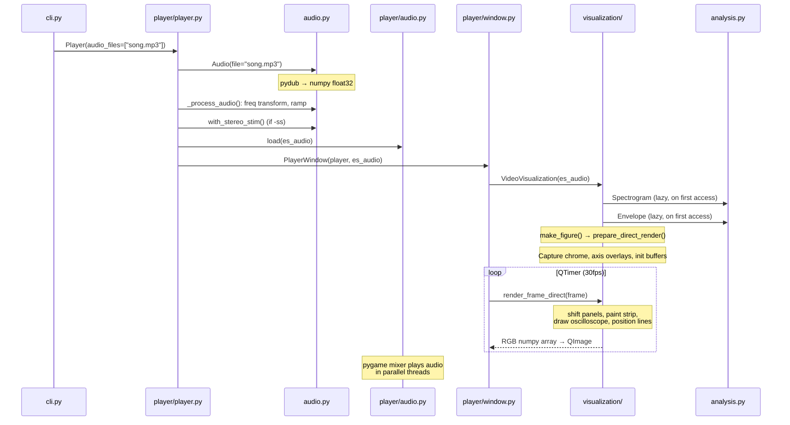
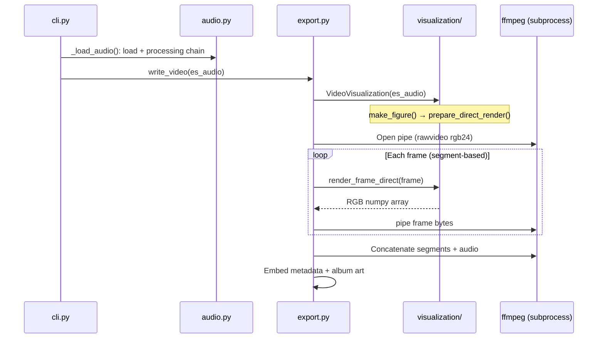
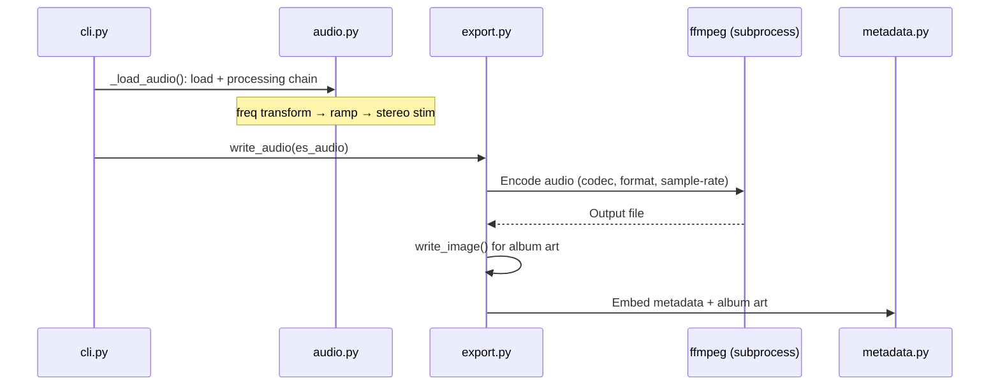
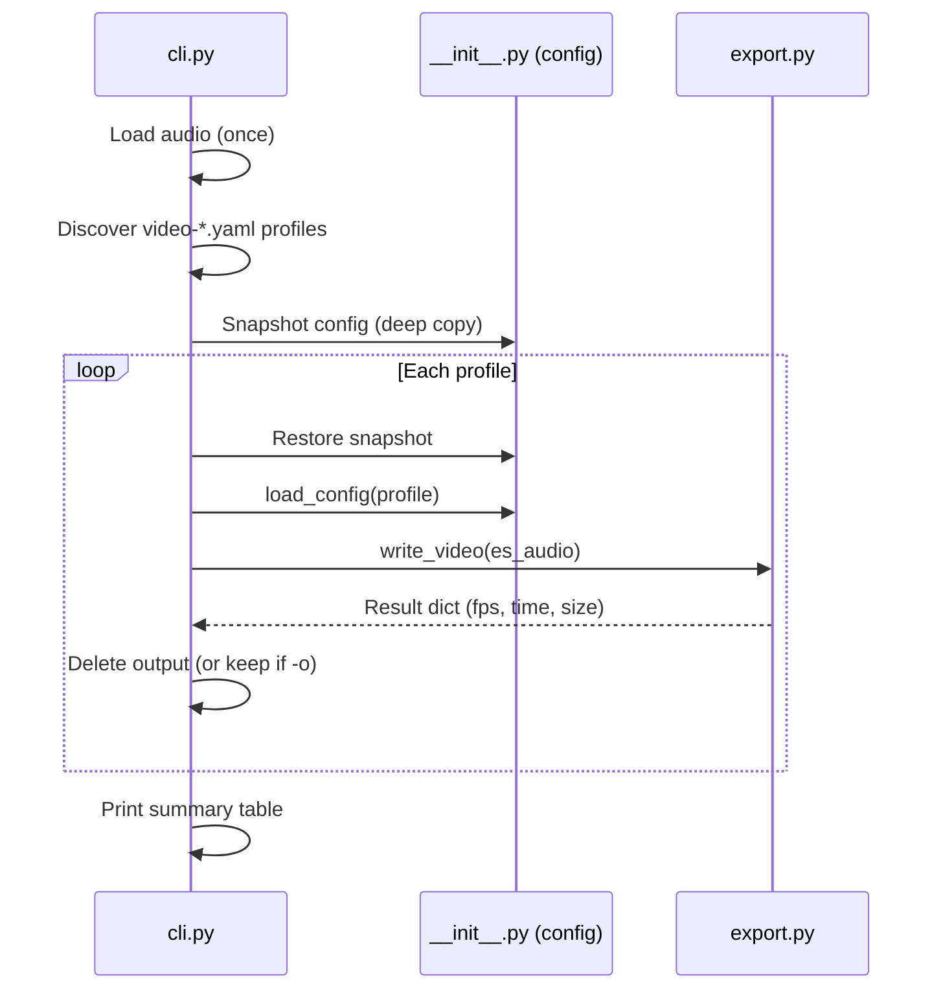

# EstimPy Architecture

EstimPy is a Python toolkit for visualizing and playing back estim audio files. It provides a CLI (`estimpy`) with subcommands to launch an interactive player, render static images, export animated videos, export processed audio, and manage audio file metadata. The core pipeline flows from **Audio** (load and normalize) through **Analysis** (compute spectrograms and envelopes) to **Visualization** (render panels via matplotlib and direct pixel manipulation), with a **Player** layer for real-time playback via a Qt GUI. All behavior is driven by a hierarchical YAML configuration system with `default.yaml` as the single source of truth for defaults.

## Directory Structure

```
src/estimpy/
├── __init__.py              # Package init, config system, event bus, dependency checks
├── cli.py                   # CLI entry point — argument parsing and command routing
├── audio.py                 # Audio loading, normalization, DSP processing chain
├── analysis.py              # DSP: spectrograms (standard + reassigned), envelopes
├── visualization/
│   ├── __init__.py          # Re-exports, config event handler, colormap derivation
│   ├── base.py              # Visualization (static images), enums, show_image, set_optimal_nfft
│   ├── video.py             # VideoVisualization: direct render pipeline, shift-and-paint
│   └── oscilloscope.py      # OscilloscopeMixin: per-channel waveform overlay
├── export.py                # File export: images (matplotlib), videos (ffmpeg pipe), audio (ffmpeg)
├── metadata.py              # ID3/MP4/FLAC tag reading/writing via mutagen
├── utils.py                 # Shared helpers: file dialogs, spinners, temp files, formatting
├── player/
│   ├── __init__.py          # Re-exports Player class
│   ├── player.py            # Playback state machine: playlist, volume, mute, repeat
│   ├── audio.py             # Low-level pygame mixer: play, stop, volume ramping
│   ├── window.py            # PyQt6 GUI: controls, keyboard shortcuts, frame loop
│   └── playlist_window.py   # Playlist management dialog (add/remove/reorder, M3U)
└── config/
    ├── default.yaml         # Canonical defaults (single source of truth)
    ├── video-*.yaml         # Video encoding profiles (hevc, av1, prores, vp9, resolutions, fps)
    ├── audio-*.yaml         # Audio export profiles (mp3, wav, flac)
    ├── image-*.yaml         # Image export profiles (4k-square, 8k-square, videopreview)
    ├── player-*.yaml        # Player device profiles (cd028, ipodtouch, galaxytabs10ultra)
    └── notitle.yaml         # Disables title overlay

tests/
├── conftest.py              # Pytest fixtures: synthetic audio, config isolation
├── generate_benchmark.py    # Generates benchmark.mp3 from source files
├── test_analysis.py         # Envelope computation, spectrogram generation, FFT sizing
├── test_audio.py            # Audio loading, normalization, triphase, resampling, DSP
├── test_cli.py              # Argument parsing, config flag handling
├── test_config.py           # Config loading, updates, type casting, event system
├── test_export.py           # Video/audio export, codec resolution, segment handling
├── test_file_io.py          # File discovery, path resolution, extension handling
├── test_metadata.py         # Tag read/write, image format detection
├── test_oscilloscope.py     # Trigger stabilization, mode detection, waveform extraction
├── test_player.py           # Player state: playlist, volume, mute, repeat, track navigation
├── test_utils.py            # Formatting, file path helpers, temp files
├── test_video.py            # Direct render pipeline, frame buffer operations
├── test_visualization.py    # Static visualization, axis layout, channel configuration
└── input/
    ├── test.mp3             # Synthetic 1s test tone
    ├── benchmark.mp3        # 1-minute benchmark file (generated, committed)
    └── benchmark/           # Source audio files for benchmark generation (gitignored)
```

The top-level modules map 1:1 to pipeline stages (load → analyze → visualize → export). The `visualization/` and `player/` packages are separate subpackages because they have significant internal structure — visualization splits rendering concerns across static images, video pipeline, and oscilloscope overlay, while player manages GUI dependencies (PyQt6, pygame) with its own internal layering (state management, audio engine, window). Config profiles live alongside the code they configure so they ship with the package.

## Configuration System

Configuration is a flat key-value dictionary built from nested YAML:

```yaml
# default.yaml (nested)              # cfg dict (flat)
analysis:                             # analysis.spectrogram.reassign: True
  spectrogram:                        # analysis.spectrogram.window-function: hann
    reassign: True                    # analysis.window-size: 2048
    window-function: hann
  window-size: 2048
```

**Design rules:**
- `default.yaml` is the **single source of truth** for all default values. Code uses `es.cfg['key']` (bracket access, raises KeyError if missing) — never `es.cfg.get('key', fallback)`.
- Named profiles (e.g., `video-4k.yaml`, `audio-flac.yaml`) override specific keys when loaded via `-c profile_name`.
- CLI `-co key value` overrides individual keys at runtime.
- The `config.updated` event notifies listeners when config changes. Derived values (like `analysis.window-overlap` computed from `analysis.window-size`, or `visualization.video.display.width`/`.height` parsed from `.size`) are set in these handlers.

**Profile resolution:** Bare profile names are resolved against both the builtin config directory (`src/estimpy/config/`) and the user config directory (`~/.estimpy/`). When a profile exists in both locations, the builtin is loaded first and the user version overlays on top. Each profile may declare `additional-config-profiles` to chain further profiles after itself, with cycle detection. The `estimpy-version` key is checked against the running version and produces a warning if the profile targets a newer release.

**Namespace conventions:**
- `video.export.*` — encoding mechanics (codec, format, fps, segment-length, keyframe-interval, preview, ffmpeg-extra-args). Controls how FFmpeg produces the video container.
- `visualization.video.export.*` — visual appearance of exported video (size, triphase, time, title, oscilloscope, window-length). Controls what the video looks like.
- `audio.export.*` — audio encoding mechanics (codec, format, sample-rate, ffmpeg-extra-args).
- The distinction: keys that exist under both `visualization.video.display.*` and `visualization.video.export.*` are visual (stay under `visualization.*`). Keys only under `export` are encoding mechanics (live at `video.export.*` or `audio.export.*`).

## Key Modules

### `__init__.py` — Package Init & Config Hub
- **Responsibility:** Load YAML configs into a flat `cfg` dict, provide an event system (`config.updated`), verify FFmpeg/FFprobe availability, import all submodules.
- **Key exports:** `cfg` (current config), `base_cfg` (file-loaded snapshot), `load_config()`, `update_config_values()`, `add_event_listener()`, `trigger_event()`, `check_dependencies()`.
- **Dependency checks:** `check_dependencies()` is public and called lazily by `export.write_video()` and `export.write_audio()` rather than at import time, so non-export operations work without FFmpeg installed.
- **Import order:** `utils, metadata, audio, analysis, player, visualization, export` — `player` before `visualization` matters for circular import avoidance (see Known Limitations).

### `audio.py` — Audio Data & Processing Chain
- **Responsibility:** Load audio files (via pydub/FFmpeg), normalize to float32 `[-1, 1]`, expose as numpy arrays shaped `(channels, samples)`, and provide the audio processing chain.
- **Key class:** `Audio` — properties: `data`, `data_raw` (reconstructed on demand), `sample_rate`, `channels`, `length`, `metadata`. Processing methods return new `Audio` instances: `with_frequency_transform()` (FFT bin mapping for scale, Hilbert SSB for shift), `with_ramp()` (amplitude ramp with exponential easing), `with_stereo_stim()` (bandpass safety filter), `with_triphase()` (derive 3rd channel as `-(A+B)`), `resample()`.
- **Processing order:** frequency transform → ramp → stereo stim → triphase. Stereo stim is always the last safety step before the visualization-only triphase derivation.
- **Dependencies:** pydub, numpy, scipy (resampling, FFT, Hilbert transform, filtering).

### `analysis.py` — DSP Engine
- **Responsibility:** Compute spectrograms and amplitude envelopes from audio data.
- **Key classes:**
  - `Spectrogram` — FFT-based spectrogram with optional reassignment for sharper time-frequency localization. Auto-scales frequency range via spectral edge detection.
  - `Envelope` — Sliding-window peak and RMS amplitude envelopes using numpy stride tricks (zero-copy).
- **Notable:** Reassigned spectrograms use three FFTs per frame, 2D histogram accumulation, and Nadaraya-Watson kernel smoothing. Processes in memory-bounded chunks (~500MB limit). Default FFT length is automatically sized based on output resolution and frequency content.

### `visualization/` — Rendering Subpackage
All visual output — matplotlib figure creation, per-frame direct pixel rendering, oscilloscope overlay, colormap derivation, and axis formatting.

- **`__init__.py`** — Re-exports the public API (`Visualization`, `VideoVisualization`, `VisualizationMode`, `show_image`, `set_optimal_nfft`), handles `config.updated` events (resolution parsing, font initialization, channel color derivation, colormap generation).
- **`base.py`** — `Visualization` class for static image rendering: matplotlib figure with amplitude + spectrogram panels per channel, layout, styling, axis formatting. Also contains `AxisScaleText`, `AxisTypes` (AMPLITUDE, AMPLITUDE_SCRUB, TITLE, SPECTROGRAM), `VisualizationMode` enums, `show_image()`, and `set_optimal_nfft()`. Analysis data (spectrograms, envelopes) is lazy-loaded via `@property` — computed once on first access and reused. Channels are visually separated by configurable black margin spacers (`visualization.style.channels.margin`, expressed as a fraction of total frame height) and framed with borders in each channel's peak amplitude color.
- **`video.py`** — `VideoVisualization(Visualization, OscilloscopeMixin)` extends the base with time-windowed sliding view and the shift-and-paint direct render pipeline (`prepare_direct_render()`, `render_frame_direct()`). This is the performance-critical path — see Direct Render Pipeline below. The global amplitude scrub bar is visually distinguished from channel panels with separator borders.
- **`oscilloscope.py`** — `OscilloscopeMixin` provides per-channel waveform overlays (~630 lines). **Trigger pipeline:** Each frame first attempts a cross-correlation trigger against the previous frame's waveform template; if correlation quality falls below a configurable threshold (`analysis.oscilloscope.trigger-correlation-threshold`), it falls back to a hysteresis-armed rising zero-crossing trigger (`analysis.oscilloscope.trigger-hysteresis`). **Mode detection:** Analyzes coefficient of variation across short sub-windows to automatically switch between tone mode (~10ms window) and pulse mode (~500ms window). **Labels:** Window length, peak frequency (via zero-padded FFT), and peak/RMS level in dBFS. Implemented as a mixin because it shares extensive instance state with `VideoVisualization` (frame buffer, data regions, channel layout, font state).
- **Dependencies:** matplotlib, PIL (ImageFont for direct text rendering), numpy, colorsys.

### `export.py` — File Output
- **Responsibility:** Write images via matplotlib, encode videos by piping raw RGB frames to FFmpeg, and export processed audio via FFmpeg encoding. Both `write_video()` and `write_audio()` call `es.check_dependencies()` before starting, return a result dict on success or `None` on failure.
- **Audio codec resolution:** Priority chain: explicit config → output file extension → source file codec (via ffprobe) → `libmp3lame` fallback. Shared by both audio and video export.
- **Video audio handling:** Unmodified audio with a container-compatible codec is stream-copied. Modified audio (stereo stim, ramp, frequency transform) or incompatible codecs are re-encoded as the container's default codec (AAC for MP4/MOV).
- **Notable:** Video export uses segment-based encoding (configurable length, default 3600s) with resume support. Segments are concatenated with FFmpeg's concat demuxer. Audio export auto-detects codec/format, generates a visualization image for album art, and embeds metadata. Metadata embedding is non-fatal — failures produce a warning rather than discarding the encoded file.

### `metadata.py` — Audio Tags
- **Responsibility:** Read/write ID3 (MP3), MP4/M4A/MOV, and FLAC tags. Extracts artist/title from filenames via regex when tags are absent.
- **Key classes:** `Metadata`, `MetadataFormat` (abstract), `MetadataFormatMP3`, `MetadataFormatMP4`, `MetadataFormatFLAC`, `MetadataImage`.
- **Dependencies:** mutagen (id3, mp4, flac).

### `player/` — Interactive Playback

**`player.py` — Playback State Machine:**
Manages playlist, playback state, per-channel volume/mute, repeat modes (`none`/`one`/`all`), and seeking. On file load, `_process_audio()` applies frequency transform and ramp; stereo stim is handled separately via the window's interactive toggle. When CLI `-ss` is set, `Player.__init__` applies stereo stim and stores the pre-SS `Audio` so toggling SS off in the player restores the processed (but unfiltered) audio.

**`audio.py` — Pygame Audio Engine:**
Low-level playback via pygame-ce mixer with smooth volume ramping. Uses a 256-sample audio buffer for fine-grained volume control (~5.8ms granularity at 44.1kHz). Volume ramps run in daemon threads. Stop uses synchronous fade-to-zero (30 steps over 90ms) to prevent audio pops. Uses module-level globals for mixer state.

**`window.py` — Qt Player GUI:**
PyQt6 main window with `VisualizationWidget(QWidget)` for the visualization canvas. Frame updates driven by QTimer at 30fps. Overrides `VideoVisualization` settings to use display config (not export config).

Control layout is two rows: playback buttons (prev, skip-back, play/pause, stop, skip-forward, next, repeat, playlist, fullscreen) span the left side across both rows. The right side top row has master volume, amplitude ramp controls, zoom, and oscilloscope toggle. The bottom row (right-justified) has per-channel volume sliders with channel-colored tints, triphase toggle, and stereostim toggle — ordered to match the visualization's channel layout from top to bottom.

The window auto-sizes to tightly bound the visualization canvas at the configured aspect ratio, constrained to 95% of screen dimensions. A seek slider with time label spans the full width above the controls.

**`playlist_window.py` — Playlist Dialog:**
Add, remove, reorder files; drag-and-drop; M3U import/export.

## Data Flow

### `estimpy play song.mp3`



### `estimpy save-video song.mp3`



### `estimpy save-audio song.mp3 -ss`



### `estimpy benchmark`



The benchmark command reuses the standard `write_video()` pipeline. Config isolation between runs is achieved by deep-copying the config dict before the loop and restoring it before each profile load. When `-c` is specified, only that profile combination is benchmarked; profile names auto-resolve the `video-` prefix. Output files saved with `-o` use timestamped names.

### Direct Render Pipeline (per frame)

The direct render pipeline avoids matplotlib's per-frame overhead by painting pixels directly into a numpy buffer:

```
1. RESTORE previous dynamic overlays (undo oscilloscope, time text, SS badge)
2. RESTORE axis underlay (undo axis tick/label overlay)
3. RESTORE position line regions (undo position lines)
4. SHIFT panel pixels left by scroll amount (memcpy)
5. PAINT new strip: sample spectrogram colormap + amplitude envelope into exposed pixels
6. SAVE position line regions, DRAW position lines (behind axes/labels)
7. SAVE axis underlay, APPLY axis overlay (alpha-composite tick marks/labels)
8. SAVE dynamic overlay regions (snapshot pixels that will be overdrawn)
9. DRAW oscilloscope boxes (per channel, if enabled)
10. DRAW time text (pre-rendered PIL text images)
```

Each frame reverses steps 8-10, then 7, then 6 from the previous frame before painting new data, creating a 4-layer compositing system (data → position lines → axes → dynamic overlays) without accumulating artifacts.

## Extension Points

**Adding a new CLI command:**
1. Add a subparser in `cli.py` (follow the `save-image` pattern).
2. Add the command name to the `subcommands` set.
3. Write a `_run_<command>()` handler.

**Adding a new visualization panel:**
1. Add an `AxisTypes` enum value in `visualization/base.py`.
2. Add height ratio config in `default.yaml` under `visualization.style.subplot-height-ratios`.
3. Create the subplot in `Visualization._make_figure_subplots()`.
4. For video mode: add strip-painting logic in `VideoVisualization` following the amplitude/spectrogram pattern.

**Adding a new config option:**
1. Add the key with its default value in `default.yaml`. This is the only place defaults should exist.
2. Access it via `es.cfg['section.subsection.key']` in code.
3. If it requires derived computation, add a handler in the relevant module's `_on_config_updated()` listener.

**Adding a new audio format for metadata:**
1. Add the format to `MetadataFileFormats` enum in `metadata.py`.
2. Subclass `MetadataFormat` and implement `_tag_fields()`, `_load_file_tags()`, `_set_file_tag_value()`, `_get_metadata_image()`.
3. Add branches for the new format in `Metadata.load()` and `Metadata.save()`.

**Adding a new config profile:**
1. Create a `.yaml` file in `src/estimpy/config/` with only the keys to override.
2. Users load it via `estimpy -c profile_name` (file extension optional).

## Key Design Decisions

**Direct pixel rendering instead of matplotlib animation:** matplotlib's `FuncAnimation` is far too slow for real-time 30fps playback and produces unnecessarily large video files. The direct pipeline captures the static "chrome" (axes, labels, borders) once from matplotlib, then shifts and paints only the data pixels each frame. This achieves ~10-50x speedup over matplotlib's per-frame redraw.

**Flat config dictionary:** YAML is nested for readability, but `es.cfg` is flattened with dot-delimited keys. This makes config access a simple dict lookup without nested traversal, and allows CLI overrides with a single `key value` syntax.

**Pygame-ce for audio, PyQt6 for GUI:** Two event loops coexist. Pygame handles audio mixing (per-channel stereo panning, volume ramping in threads) while PyQt6 handles the window. This avoids reimplementing audio mixing in Qt and leverages pygame's mature SDL2 mixer.

**Reassigned spectrogram with Nadaraya-Watson smoothing:** Standard spectrograms blur energy across time-frequency bins. Reassignment sharpens localization by moving energy to its "true" center, but creates sparse, noisy output. The NW kernel smoothing fills gaps while preserving magnitude — important for estim audio where precise frequency content matters.

**Triphase as a virtual 3rd channel:** Instead of a separate rendering path, triphase mode (`-(A+B)`) creates a 3-channel `Audio` object. The rest of the pipeline handles it generically through `_channel_layout`, which simply reports 3 channels instead of 2.

**Oscilloscope as a mixin class:** The oscilloscope's methods share extensive instance state with `VideoVisualization` — frame buffer, data regions, amplitude colors, spectrogram times, channel layout, and font state. A standalone class would require passing 10+ parameters to every call. The mixin keeps oscilloscope code cleanly separated while giving it natural access to the host's state.

**Volume ramping in daemon threads:** Abrupt volume changes cause audible clicks. Every volume change (including stop) ramps smoothly over configurable durations via background threads. The 256-sample audio buffer ensures volume changes take effect within ~6ms.

## Known Limitations

**Global mutable state in `player/audio.py`.** The pygame audio engine uses module-level globals (`_is_playing`, `_channels`, `_volumes`, etc.) instead of a class instance. This precludes multiple simultaneous players.

**Config system has no schema validation.** Invalid keys are caught at `update_config_values()` time, but type mismatches between YAML values and code expectations are only caught at point of use.

**Circular import avoidance via lazy import.** `Player.__init__()` imports `PlayerWindow` inside the constructor because `player` is imported before `visualization` in `__init__.py`. This works but is fragile — import order changes can surface as circular import errors.

**Video export memory usage scales with segment length.** Each segment holds the full spectrogram in memory. For very long files, this can consume significant RAM despite the chunked reassignment computation.
